# Convolución, correlación y transformada de Fourier 

## Asignatura

Procesamiento Digital de Señales

## Programa

Ingeniería Biomédica – Universidad Militar Nueva Granada

## Práctica de laboratorio

**Convolución, correlación y transformada de Fourier**

## Integrantes

Danna Jimena Medina Ríos – Código 5600923
María José Polo Tovar – Código 5600894

---

## Descripción

Este informe presenta el desarrollo y análisis de la convolución, correlación y transformada de Fourier aplicadas a señales discretas y biológicas. Incluye el cálculo manual y en Python, la caracterización estadística en el dominio del tiempo y el análisis espectral en el dominio de la frecuencia.

---
## Metodología
El desarrollo del laboratorio se dividió en tres partes principales.
En la primera parte, se realizó el cálculo de la convolución entre dos secuencias discretas, tanto de forma manual como mediante Python, junto con su representación gráfica. En la segunda parte, se determinó la correlación cruzada entre dos señales sinusoidales y se analizó su comportamiento. Finalmente, se generó, capturó y digitalizó una señal biológica para su caracterización estadística en el dominio del tiempo y su análisis espectral mediante la transformada de Fourier.

<p align="center">
  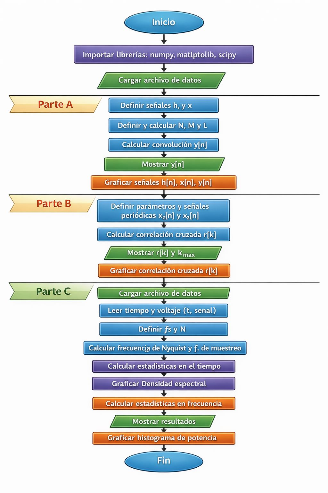
</p>

<p align="center">
  <em>Diagrama de flujo</em> 
</p>

---

### Parte A
En primer lugar, se realizó la representación gráfica de las señales x[n] de forma manual. Para ello se tomaron los valores de cada secuencia y se construyeron sus respectivas gráficas, donde cada muestra se representa mediante una línea vertical terminada en un punto. Esta representación permitió visualizar el comportamiento discreto de las señales y ubicar correctamente cada valor respecto al índice n.

$$h(n) =[5,6,0,0,9,2,3,5,6,0,0,8,9,4]$$
$$x(n) =[1,0,2,9,1,4,3,2,6,4,1,1,0,6,2,2,7,7,8,9]$$
<p align="center">
  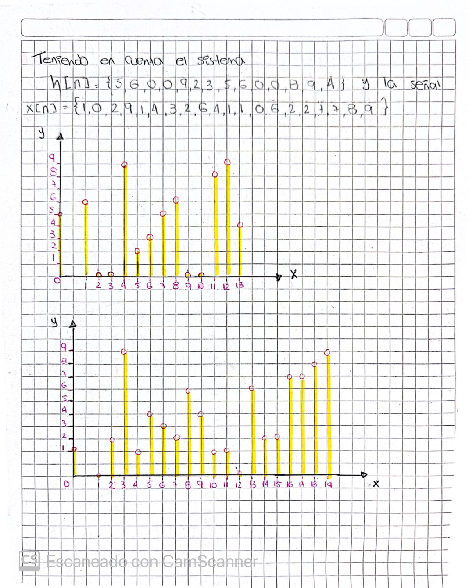
</p>

<p align="center">
  <em>Señales</em> 
</p>

osteriormente, se determinó la longitud de las señales involucradas en el sistema. La señal h[n] corresponde a la respuesta del sistema y está formada por 14 muestras, mientras que la señal x[n] corresponde a la señal de entrada y contiene 20 muestras. A partir de estos valores se calculó la longitud de la señal resultante y[n]. De esta forma se obtuvo que la señal resultante tiene 33 muestras. Se realizó el cálculo de la convolución de forma manual utilizando la definición matemática de la convolución discreta $$y[n]=∑x[k]h[n−k]$$ Este procedimiento consiste en calcular la convolución de forma manual utilizando una tabla. En esta tabla se organizaron los desplazamientos de la señal h[n] respecto a la señal x[n], realizando las multiplicaciones entre los valores correspondientes en cada posición. Posteriormente se sumaron los productos obtenidos en cada desplazamiento para calcular cada valor de la señal resultante y[n]. Este método permitió visualizar de manera ordenada el proceso de convolución y facilitar el cálculo de cada término de la secuencia resultante. También se graficó la señal y[n] resultante.
<p align="center">
  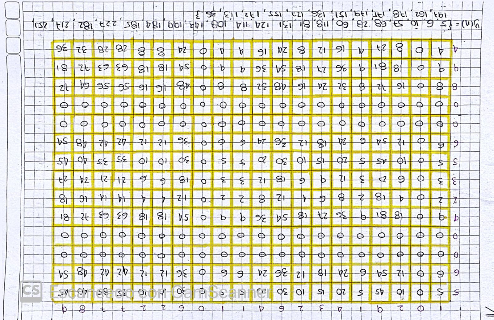
</p>
<p align="center">
  <em>Convolucion Parte A </em> 
</p>

<p align="center">
  
</p>
<p align="center">
  <em>GRAFICA A MANO</em> 
</p>

Posteriormente se implementó el procedimiento en Python con el objetivo de verificar los resultados obtenidos de ambas maneras, automatizar el cálculo y representar gráficamente la señal resultante.
Se definieron dos señales discretas en Python: x[n] y h[n]. Ambas señales se almacenan como arreglos (array), lo que permite realizar operaciones matemáticas de manera eficiente y además se graficaron.

```python
h = np.array([5,6,0,0,9,2,3,5,6,0,0,8,9,4])
x = np.array([1,0,2,9,1,4,3,2,6,4,1,1,0,6,2,2,7,7,8,9])
```
<p align="center">
  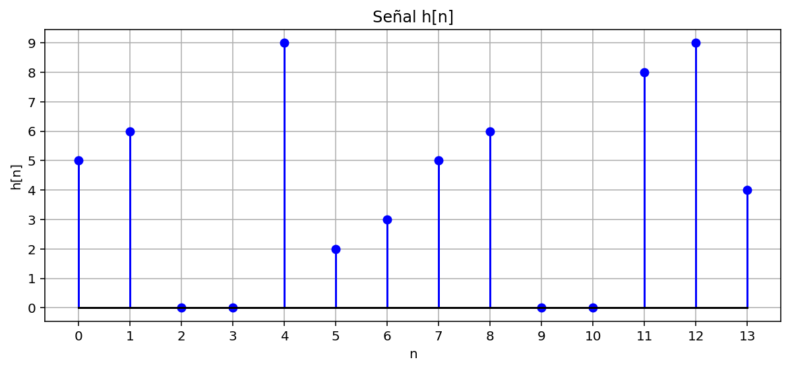
</p>
<p align="center">
  <em>H[n]</em> 
</p>

<p align="center">
  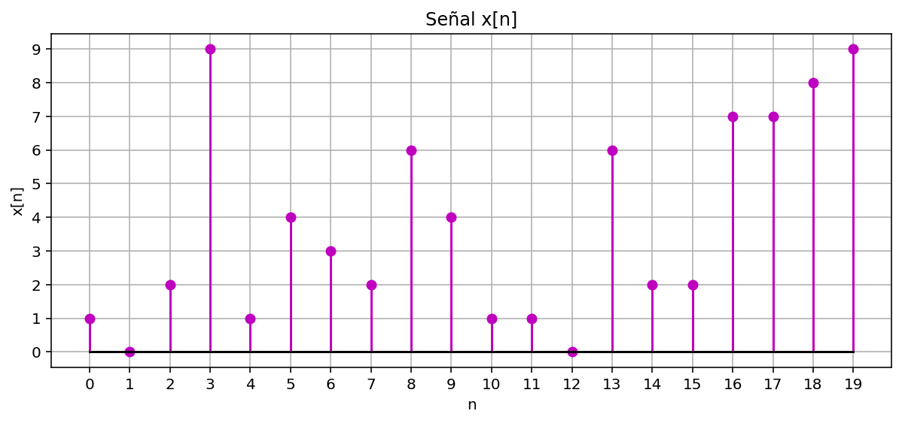
</p>

<p align="center">
  <em>X[n]</em> 
</p>

La convolucion se realizó mediante:

```python
y = np.convolve(x, h)
```
y se procedio a graficar

<p align="center">
  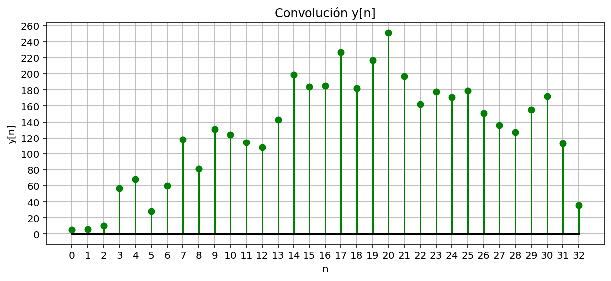
</p>

<p align="center">
  <em>Y[n]</em> 
</p>

Para mostrar la secuencia resultante de forma organizada se utilizó:

```python
print(", ".join(map(str, y)))
```
<p align="center">
  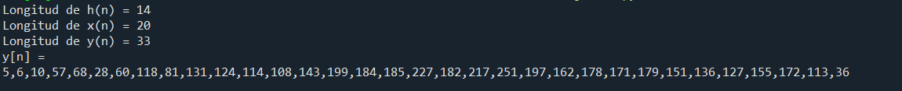
</p>

<p align="center">
  <em>Señal Y[n]</em> 
</p>
Esto convierte cada elemento del arreglo en texto y los muestra separados por comas, facilitando la comparación con el cálculo manual.

Se creó el vector `np.arange(len(y))` para representar los valores n del eje horizontal, correspondientes a cada muestra de la señal resultante.

Se utilizó la función `stem()` para graficar la señal discreta, representa cada muestra como un impulso vertical y `figsize=(14,4)` ampliar el eje horizontal para mejorar la visualización.

---

### Parte B
En esta parte se analizaron dos señales discretas definidas a partir de funciones trigonométricas. El objetivo fue calcular la correlación cruzada entre ambas señales para analizar el grado de similitud entre ellas cuando una se desplaza respecto a la otra.

Las señales fueron definidas utilizando una frecuencia de 100 Hz y un período de muestreo $$T_s=1.25ms$$. A partir de estos parámetros se generaron dos secuencias discretas: $x_1[n]$ y $x_2[n]$, correspondientes a una función coseno y una función seno respectivamente.

En Python, las señales se definieron de la siguiente manera:
```python
Ts = 0.00125
f = 100
n = np.arange(0,9)

w = 2*np.pi*f*Ts

x1 = np.cos(w*n)
x2 = np.sin(w*n)
```
Estas expresiones corresponden matemáticamente a:

$$
x_1[n] = \cos(2\pi 100 n T_s)
$$

$$
x_2[n] = \sin(2\pi 100 n T_s)
$$


<p align="center">
  
</p>
<p align="center">
   <em>Señal discreta x<sub>1</sub>[n]</em>
</p>

<p align="center">
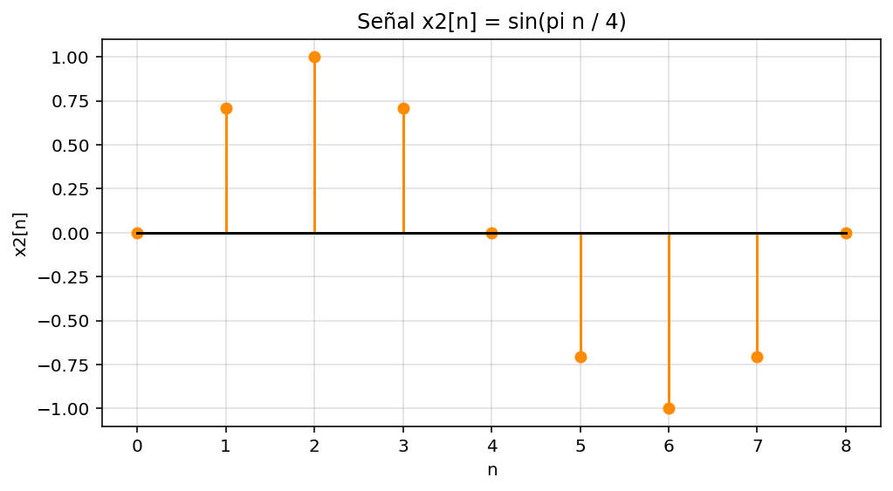
</p>
<p align="center">
    <em>Señal discreta x<sub>2</sub>[n]</em>
</p>

Posteriormente se calculó la correlación cruzada, la cual permite medir la similitud entre dos señales cuando una de ellas se desplaza en el tiempo. Esta operación es ampliamente utilizada en procesamiento digital de señales para identificar retardos o coincidencias entre señales.

En Python, la correlación se calculó mediante la función:
```python
r = np.correlate(x1, x2, mode='full')
```
El resultado de esta operación es una nueva secuencia $$r[k]$$ que representa la correlación entre las dos señales para distintos valores de desplazamiento. Para representar los retardos en el eje horizontal se definió el siguiente vector:
```python
k = np.arange(-(len(x1)-1), len(x1))
```
Finalmente, para visualizar el comportamiento de la correlación cruzada se utilizó la función stem(), la cual permite representar señales discretas mediante impulsos verticales, facilitando la interpretación de cada muestra.

<p align="center">
  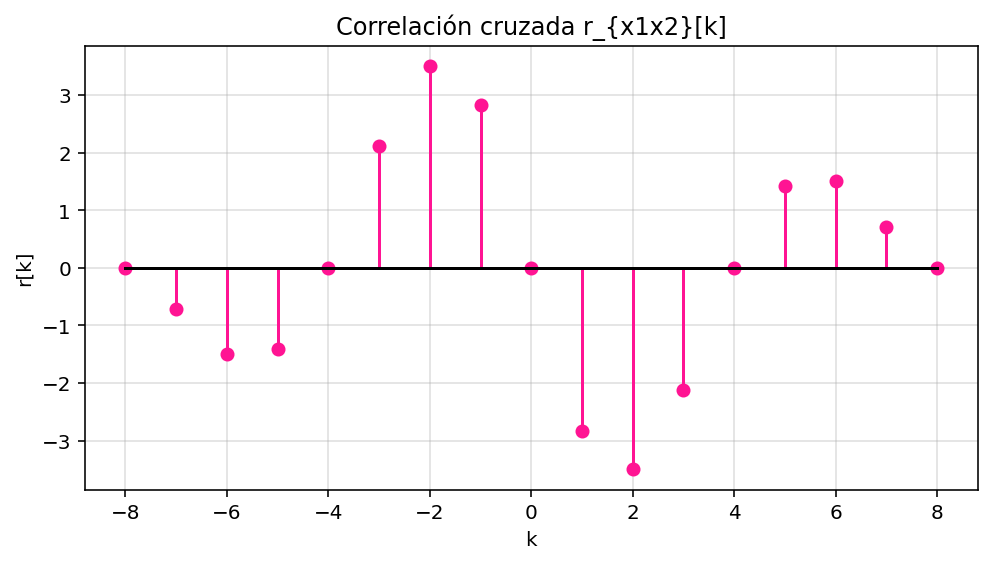
</p>
<p align="center">
   <em>Correlación cruzada r<sub>x₁x₂</sub>[k]</em>
</p>

A partir de la gráfica obtenida se observa que la correlación presenta un valor máximo cuando  $$k=2$$. Esto indica que las señales presentan mayor similitud cuando una de ellas se desplaza dos muestras respecto a la otra. Este comportamiento se debe a que las funciones seno y coseno poseen un desfase de 90°, lo cual se refleja en el desplazamiento observado en la correlación.

De esta manera, el análisis confirma que la correlación cruzada es una herramienta útil para estudiar la relación entre señales discretas y detectar retardos entre ellas.
<p align="center">
  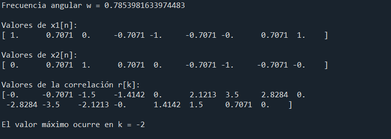
</p>
<p align="center">
   <em>Correlación cruzada</em>
</p>

---

### Parte C

En esta parte del laboratorio se generó y analizó una señal biológica utilizando el generador de señales biológicas. La señal utilizada corresponde a una señal EOG (Electrooculografía), la cual registra variaciones de potencial eléctrico producidas por el movimiento ocular. Inicialmente se cargó el archivo que contiene la señal adquirida, el cual presenta dos columnas: la primera corresponde al tiempo de adquisición y la segunda al voltaje registrado por el sistema de medición. Posteriormente se separaron estas columnas en dos variables independientes para facilitar su procesamiento y análisis dentro del programa.

```python
# Cargar archivo con los datos de la señal
ruta_archivo = r"C:/Users/Usuario/Downloads/Procesamiento de señales/lab 2/senal_eog.txt"

datos = np.loadtxt(ruta_archivo, skiprows=1)

# Separar columnas de tiempo y señal
t = datos[:,0]
senal = datos[:,1]

# Frecuencia de muestreo utilizada durante la adquisición
fs = 300

# Número total de muestras
N = len(senal)

print("Número de muestras:", N)
```

Una vez cargada la señal, se procedió a determinar la frecuencia de Nyquist, la cual representa la frecuencia mínima de muestreo necesaria para evitar pérdida de información en la digitalización de la señal. En este caso se consideró que la frecuencia máxima presente en la señal es de 30 Hz, por lo que la frecuencia de Nyquist corresponde al doble de esta frecuencia. Posteriormente se estableció la frecuencia de muestreo utilizada en el sistema de adquisición, la cual se definió como cuatro veces la frecuencia de Nyquist, con el objetivo de garantizar una representación digital adecuada de la señal y minimizar posibles efectos de aliasing durante el proceso de digitalización, no obstante se generó una frecuencia de muestreo mayor a la obtenida.

```python
# Cálculo de la frecuencia de Nyquist
fD = 30
f_nyquist = fD * 2
print("Frecuencia de Nyquist:", f_nyquist, "Hz")

# Frecuencia de muestreo utilizada para digitalizar la señal
fmuestreo = 4 * f_nyquist
print("Frecuencia de muestreo:", fmuestreo, "Hz")
```
Posteriormente se realizó la caracterización estadística de la señal en el dominio del tiempo, con el objetivo de describir el comportamiento general de la señal adquirida. Para ello se calcularon parámetros estadísticos fundamentales tales como la media, la mediana, la desviación estándar, así como los valores máximo y mínimo, que permiten identificar los extremos de la señal durante el periodo de adquisición. Estos parámetros proporcionan una descripción cuantitativa del comportamiento de la señal biológica registrada.

```python
# Cálculo de estadísticas en el dominio del tiempo
media = np.mean(senal)
mediana = np.median(senal)
desv_std = np.std(senal)
maximo = np.max(senal)
minimo = np.min(senal)

print("Media:", media)
print("Mediana:", mediana)
print("Desviación estándar:", desv_std)
print("Máximo:", maximo)
print("Mínimo:", minimo)
```
<p align="center">
  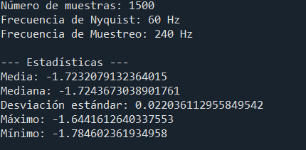
</p>
<p align="center">
   <em>Muestras y datos </em>
</p>
Una vez obtenidas las características estadísticas de la señal, se realizó su representación gráfica en el dominio del tiempo, con el objetivo de visualizar la evolución del voltaje en función del tiempo durante el proceso de adquisición. Esta representación permite observar el comportamiento general de la señal EOG, así como identificar posibles variaciones o patrones asociados al movimiento ocular registrado por el sistema.

```python
# Representación de la señal en el dominio del tiempo
plt.figure(figsize=(16,4))
plt.plot(t, senal)
plt.xlabel("Tiempo (s)")
plt.ylabel("Voltaje (V)")
plt.title("Señal EOG en el dominio del tiempo")
plt.grid()
plt.show()
```
<p align="center">
  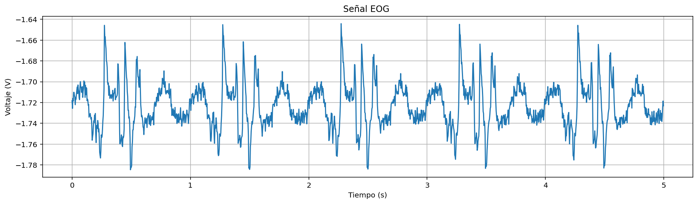
</p>
<p align="center">
   <em>Señal EOG</em>
</p>
La señal EOG se clasifica como una señal aleatoria porque los movimientos oculares que la generan dependen de procesos fisiológicos que no pueden predecirse exactamente y presentan variaciones debidas a ruido biológico y electrónico. Además, es aperiódica, ya que los movimientos de los ojos, como parpadeos o sacadas, no ocurren en intervalos regulares ni producen una forma de onda que se repita de manera idéntica en el tiempo. Finalmente, en este caso se trata de una señal digital, porque fue adquirida mediante un sistema de muestreo y posteriormente almacenada y procesada en Python, lo que implica que está representada por valores discretos en el tiempo y cuantificados numéricamente. 

Posteriormente se realizó el análisis de la señal en el dominio de la frecuencia mediante la aplicación de la Transformada Rápida de Fourier (FFT). Este procedimiento permite transformar la señal desde el dominio del tiempo al dominio de la frecuencia, con el objetivo de identificar las componentes de frecuencia presentes en la señal. A partir de esta transformación se obtuvo el espectro de magnitud, el cual muestra cómo se distribuyen las amplitudes de las diferentes frecuencias que componen la señal biológica.

```python
# Transformada de Fourier
frecuencias = np.fft.fftfreq(N, 1/fs)
fft_senal = np.fft.fft(senal)

magnitud = np.abs(fft_senal) / N

plt.figure(figsize=(12,5))
plt.plot(frecuencias[:N//2], magnitud[:N//2])

plt.xlabel("Frecuencia (Hz)")
plt.ylabel("Magnitud")
plt.title("Transformada de Fourier de la señal EOG")

plt.xlim(0, fs/2)
plt.grid()
plt.show()
```
Para la visualizacion de esto obtuvinos dos graficas, cambiando las escalas para su mejor comprension.
<p align="center">
  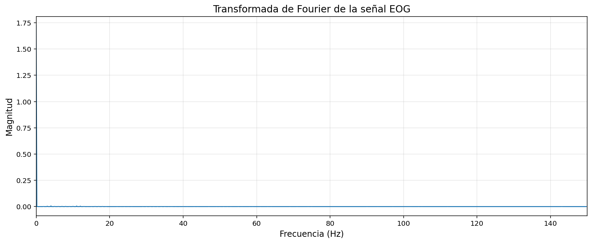
</p>
<p align="center">
   <em>Transformada Rápida de Fourier</em>
</p>

<p align="center">
  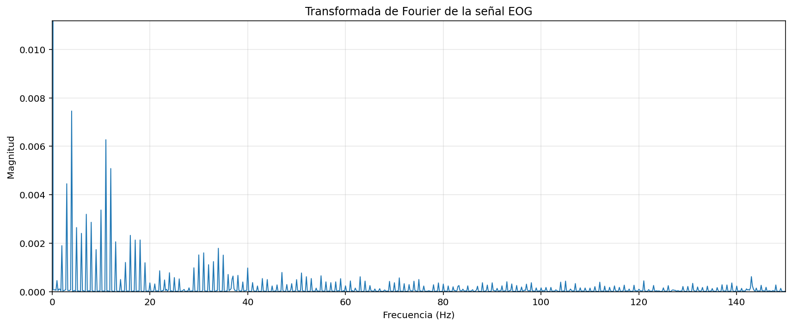
</p>
<p align="center">
   <em>Transformada Rápida de Fourier Ampliada </em>
</p>
Con el fin de analizar de manera más detallada la distribución de energía de la señal en el dominio de la frecuencia, se calculó la densidad espectral de potencia (PSD) utilizando el método de Welch. Este método divide la señal en segmentos y calcula el espectro promedio, lo cual permite obtener una estimación más estable de la distribución de potencia en las diferentes frecuencias presentes en la señal.

```python
# Densidad espectral de potencia mediante método de Welch
frecs, psd = signal.welch(senal, fs, nperseg=512)

plt.figure(figsize=(12,4))
plt.semilogy(frecs, psd)

plt.xlabel("Frecuencia (Hz)")
plt.ylabel("Densidad espectral de potencia")
plt.title("Densidad espectral de potencia de la señal EOG")

plt.grid()
plt.show()
```
<p align="center">
  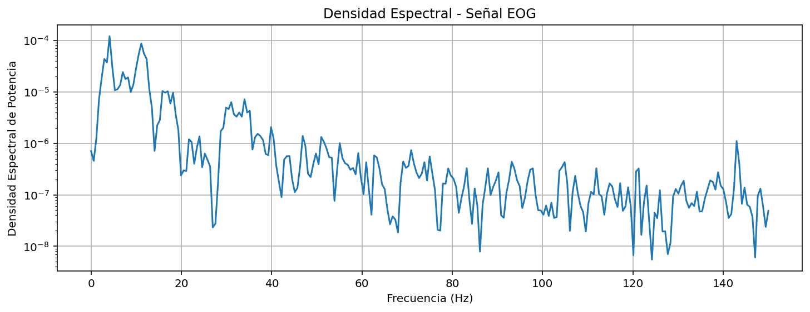
</p>
<p align="center">
   <em>Densidad espectral</em>
</p>

Finalmente se realizó el cálculo de estadísticos en el dominio de la frecuencia, incluyendo la frecuencia media, la frecuencia mediana y la desviación estándar de las frecuencias, utilizando la distribución de potencia obtenida previamente. Estos parámetros permiten describir la distribución espectral de la señal y caracterizar las frecuencias predominantes presentes en la señal biológica. Adicionalmente se construyó un histograma de frecuencias ponderado por la potencia, el cual permite visualizar cómo se distribuye la energía de la señal en el espectro de frecuencias.

```python
# Cálculo de estadísticos en el dominio de frecuencia
freq_media = np.sum(frecs * psd) / np.sum(psd)

psd_acumulada = np.cumsum(psd)
psd_total = psd_acumulada[-1]

indice_mediana = np.where(psd_acumulada >= psd_total/2)[0][0]
freq_mediana = frecs[indice_mediana]

freq_std = np.sqrt(np.sum(((frecs - freq_media)**2) * psd) / np.sum(psd))

print("Frecuencia media:", freq_media)
print("Frecuencia mediana:", freq_mediana)
print("Desviación estándar de frecuencia:", freq_std)

# Histograma de frecuencias
plt.figure(figsize=(12,4))
plt.hist(frecs, bins=40, weights=psd, edgecolor="black")

plt.xlabel("Frecuencia (Hz)")
plt.ylabel("Potencia acumulada")
plt.title("Histograma de distribución de potencia por frecuencia")

plt.grid()
plt.show()
```
<p align="center">
  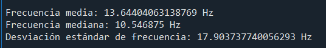
</p>
<p align="center">
   <em>Estadisticos de frecuencias</em>
</p>

<p align="center">
  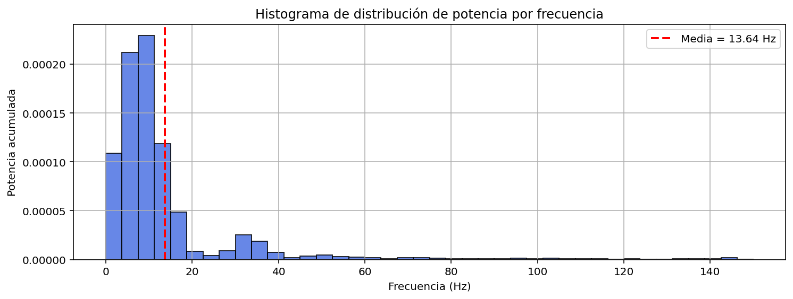
</p>
<p align="center">
   <em>Histograma de distribución de potencia por frecuencia</em>
</p>

---
### Análisis de resultados 

Análisis
En el desarrollo del laboratorio se utilizaron convolución y correlación cruzada como herramientas fundamentales del Procesamiento Digital de Señales para analizar señales discretas y comprender su posible aplicación en señales biomédicas. En la Parte A se implementó la convolución mediante la operación $y = np.convolve(x, h)$ donde la señal $x[n]$ representa la entrada del sistema y $h[n]$ la respuesta al impulso. A partir de esta operación se obtuvo la señal de salida $y[n]$, cuya longitud corresponde a la suma de las longitudes de ambas señales menos uno. Este procedimiento permitió evidenciar que la convolución puede utilizarse para modelar sistemas digitales o aplicar filtros, lo cual en el contexto de señales biomédicas resulta útil para suavizar ruido, resaltar componentes relevantes o simular el comportamiento de sistemas de adquisición de señales fisiológicas. En la Parte B se aplicó la correlación cruzada entre dos señales sinusoidales utilizando la función $np.correlate$, lo que permitió medir la similitud entre ambas señales en diferentes retardos y determinar el desplazamiento donde la correlación es máxima. Este análisis muestra que la correlación puede emplearse en señales biomédicas para detectar patrones, estimar desfases temporales o alinear señales provenientes de diferentes sensores. Sin embargo, también se identifican algunas limitaciones, ya que las señales biomédicas reales suelen ser no estacionarias, ruidosas y altamente variables, lo que puede afectar la precisión de los resultados obtenidos mediante correlación o filtrado por convolución si no se seleccionan adecuadamente los parámetros del procesamiento.

En la Parte C del laboratorio se analizó una señal biomédica EOG utilizando la Transformada de Fourier, lo que permitió estudiar su comportamiento en el dominio de la frecuencia. Inicialmente se cargó la señal y se calcularon estadísticas básicas en el dominio temporal, como media, mediana, desviación estándar, valores máximos y mínimos. Posteriormente se aplicó la Transformada Rápida de Fourier (FFT) mediante $np.fft.fft$, con el objetivo de obtener el espectro de magnitud de la señal y analizar las frecuencias presentes en ella. Además, se estimó la densidad espectral de potencia utilizando el método de Welch, lo cual permitió observar cómo se distribuye la energía de la señal en diferentes frecuencias y calcular parámetros espectrales como frecuencia media, frecuencia mediana y desviación estándar de frecuencia. Este tipo de análisis demuestra que la transformada de Fourier tiene un gran alcance en aplicaciones de procesamiento de señales, ya que permite identificar componentes frecuenciales relevantes, analizar el contenido espectral y apoyar el diseño de filtros digitales. No obstante, también presenta limitaciones cuando se considera su aplicación en tiempo real, ya que la transformada de Fourier analiza bloques de señal y proporciona información global del contenido en frecuencia, sin indicar con precisión en qué instante del tiempo ocurren determinados eventos o cambios en la señal. Asimismo, existe un compromiso entre resolución temporal y resolución frecuencial, puesto que ventanas de análisis más largas mejoran la precisión en frecuencia pero pueden incrementar la latencia del sistema. Por esta razón, en aplicaciones biomédicas donde la señal presenta cambios rápidos o transitorios, suele ser necesario complementar este análisis con métodos de análisis tiempo–frecuencia.

---
### Preguntas para la discusión

1. ¿Qué utilidad poseen herramientas como la convolución y la correlación en áreas como procesamiento de imágenes?
  
En el Procesamiento Digital de Señales, la convolución y la correlación son operaciones fundamentales para el análisis y procesamiento de señales discretas, incluyendo imágenes digitales, que pueden interpretarse como señales bidimensionales.
La convolución es esencial para describir el comportamiento de los sistemas lineales e invariantes en el tiempo (LTI). En este contexto, la salida de un sistema se obtiene mediante la convolución entre la señal de entrada y la respuesta al impulso del sistema. En procesamiento de imágenes, esto permite implementar filtros digitales que modifican o mejoran ciertas características de la señal. Por ejemplo:

- Filtrado pasa-bajos, utilizado para suavizar la señal o reducir ruido.
- Filtrado pasa-altos, que permite resaltar transiciones rápidas como bordes.
- Filtrado espacial, que mejora detalles o elimina componentes no deseados.

Por otro lado, la correlación se utiliza principalmente para medir el grado de similitud entre señales o entre diferentes segmentos de una misma señal. En PDS es útil para:

- Detección de patrones o señales conocidas dentro de una señal recibida.
- Sincronización de señales en sistemas de comunicación.
- Estimación de retardos temporales entre señales.

En general, ambas operaciones permiten analizar la estructura de las señales, diseñar filtros digitales y extraer información relevante, lo que las convierte en herramientas esenciales dentro del procesamiento digital de señales.


2. ¿En cuáles contextos de aplicación la transformada de Fourier ofrece un
conjunto de características con mayor poder discriminativo que las que
suelen considerarse desde el dominio temporal?

La Transformada de Fourier permite representar una señal en el dominio de la frecuencia, descomponiéndola en la suma de componentes sinusoidales. En muchos problemas de procesamiento digital de señales, esta representación proporciona información más clara y discriminativa que el análisis directo en el dominio temporal.
Esto ocurre especialmente cuando las características importantes de la señal están relacionadas con su contenido espectral. Algunos contextos relevantes incluyen:

- Análisis espectral de señales, donde se identifican frecuencias dominantes.
- Filtrado digital, ya que muchos filtros se diseñan y analizan en el dominio de la frecuencia.
- Procesamiento de audio, donde la información relevante se encuentra en las bandas de frecuencia.
- Análisis de vibraciones o señales biomédicas, en las que ciertos fenómenos se identifican por componentes espectrales específicas.
- Procesamiento de imágenes, donde las texturas o patrones repetitivos se identifican mejor mediante su espectro.
  
Además, la transformada de Fourier simplifica ciertas operaciones matemáticas importantes en PDS, como el hecho de que la convolución en el dominio temporal equivale a una multiplicación en el dominio de la frecuencia, lo que facilita el diseño e implementación eficiente de filtros.


3. ¿En qué se diferencia la correlación cruzada de la convolución?
   
En el Procesamiento Digital de Señales, la convolución y la correlación cruzada son operaciones estrechamente relacionadas, pero tienen objetivos distintos.
La convolución se utiliza principalmente para describir la respuesta de un sistema LTI a una señal de entrada. Matemáticamente implica invertir temporalmente una de las señales antes de realizar el desplazamiento y la multiplicación punto a punto.
En cambio, la correlación cruzada mide la similitud entre dos señales en función de un desplazamiento temporal. A diferencia de la convolución, en la correlación no se invierte la señal, sino que se compara directamente para determinar en qué desplazamiento ambas señales presentan mayor coincidencia.
En términos prácticos dentro de PDS:

- Convolución:
Se utiliza para filtrado digital y análisis de sistemas.

- Correlación cruzada:
Se utiliza para detectar señales, estimar retardos y analizar similitud entre señales.

Por lo tanto, aunque ambas operaciones implican desplazamiento, multiplicación y suma, su diferencia principal radica en el objetivo del análisis y la inversión temporal presente en la convolución.

---
### Referencias 
Oppenheim, A. V., & Schafer, R. W. (2010). Discrete-time signal processing (3rd ed.). Pearson.

Proakis, J. G., & Manolakis, D. G. (2007). Digital signal processing: Principles, algorithms, and applications (4th ed.). Pearson Prentice Hall.

Cohen, L. (1995). Time-frequency analysis. Prentice Hall.

Semmlow, J. L., & Griffel, B. (2014). Biosignal and biomedical image processing: MATLAB-based applications (3rd ed.). CRC Press.
